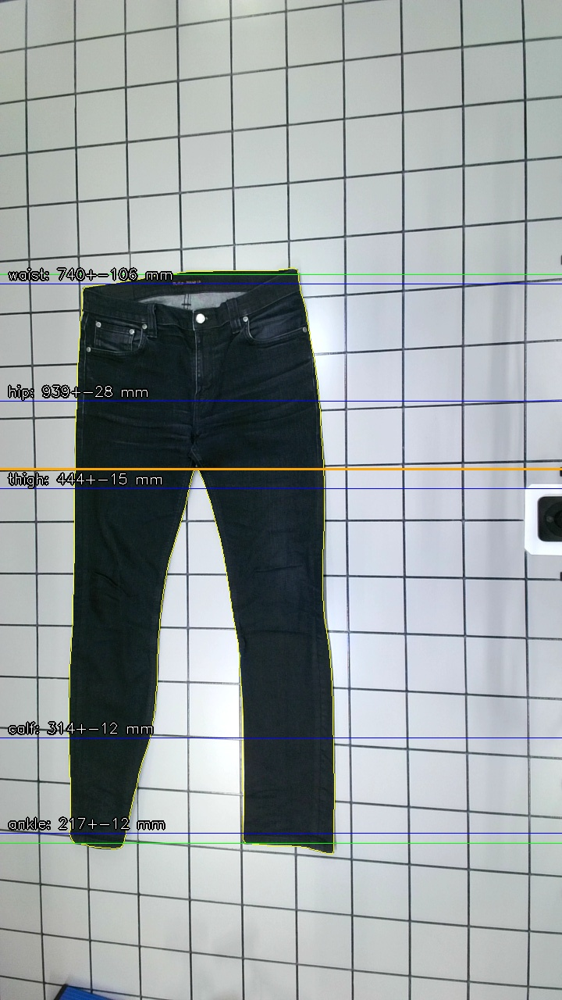
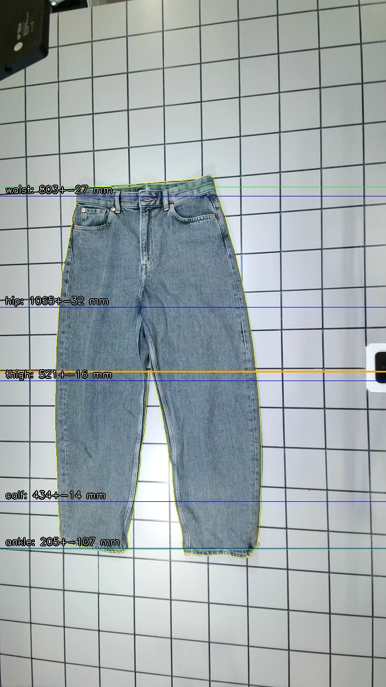
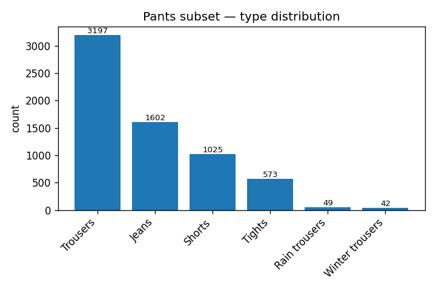

# fingerprint-mvp

Extract waist, hip, thigh, calf and ankle circumferences from a single
top-down photo of jeans (or trousers) laid flat. Targets the
[Circular Fashion v2](https://fnauman.github.io/second-hand-fashion/)
dataset's 10×10 cm tile-grid background as a scale reference.



This is a research-grade PoC. The numbers are plausible across a 10-jeans
validation slice — see [Results](#results) — but there are known geometry
edge cases that have not been fixed yet (see
[Known limitations](#known-limitations)).

## Pipeline

1. **Segmentation** — [rembg](https://github.com/danielgatis/rembg) (U²-Net
   via ONNX). Earlier versions used HSV + GrabCut and a tile-background
   prior; both failed on dark denim or touching-leg silhouettes.
2. **Scale** — at 1280×720 the tile period is ~66 px, so px/mm ≈ 0.66.
   Currently passed in via `--manual-px-per-mm`; per-image tile-grid
   detection is the next step.
3. **Orientation** — a 90° clockwise rotation puts the waistband at the
   top of the canvas (dataset images are landscape with the waistband to
   the right).
4. **Anatomical landmarks** — `y_top` and per-leg cuffs from the row-width
   profile; crotch from a bottom-up 2-run scan with a width-minimum
   fallback for touching-leg jeans.
5. **Circumferences** — sample the half-width at fixed yoke ratios
   (`waist=0.05, hip=0.65`) and per-leg ratios
   (`thigh=0.05, calf=0.70, ankle=0.95`), then double.

The A4 reference mode from the original prototype is still in the code
as a fallback for user-shot photos, but the rembg + manual-scale path is
the primary one.

## Install

```bash
python3 -m venv .venv
source .venv/bin/activate
pip install -r requirements.txt
```

The first `--rembg` run downloads ~176 MB of ONNX weights to `~/.u2net/`.

## Try it on the bundled examples

Two sample images from the dataset are bundled in [`examples/`](examples/)
under CC-BY 4.0 (see [examples/ATTRIBUTION.md](examples/ATTRIBUTION.md))
so you can reproduce the pipeline without downloading the full dataset:

```bash
python measure_jeans.py examples/nudie_jeans.jpg \
    --no-click --manual-px-per-mm 0.66 --rembg \
    --debug-dir out/nudie --json out/nudie/result.json
```

The debug folder gets the input, the segmentation mask, the rotated mask,
and an annotated overlay showing the five landmark rows. The JSON has
per-measurement circumferences, uncertainty and component breakdown.

## Usage

Single image, rembg segmentation:

```bash
python measure_jeans.py path/to/jeans.jpg \
    --no-click --manual-px-per-mm 0.66 --rembg \
    --debug-dir out/ --json out/result.json
```

Reproduce the 10-jeans validation table:

```bash
export CIRCULAR_FASHION_ROOT=/path/to/circular_fashion_v2
python dataset_eval/run_sample10.py
```

## Results

10/10 jeans from the validation slice produce plausible numbers
end-to-end with the default settings:

| Brand         | Sz | Waist | Hip  | Thigh | Calf | Ankle |
| ------------- | -- | ----: | ---: | ----: | ---: | ----: |
| Flash         | 42 |   878 | 1054 |   498 |  461 |   464 |
| Dressman      | 44 |   901 | 1261 |   577 |  412 |   391 |
| Kappahl       | 38 |   723 |  910 |   438 |  461 |   263 |
| H&M           | 38 |   803 | 1065 |   521 |  434 |   205 |
| Ralph Lauren  | 36 |   727 | 1134 |   528 |  438 |   438 |
| Esmara (Lidl) | 38 |   783 |  876 |   419 |  333 |   333 |
| Dr Denim      | 44 |   910 | 1071 |   468 |  368 |   286 |
| Hugo Boss     | 42 |   910 | 1041 |   451 |  358 |   108 |
| Kappahl       | 42 |   833 |  929 |   504 |  500 |   414 |
| Nudie Jeans   | 34 |   740 |  939 |   444 |  314 |   217 |

All values in mm, doubled-half-width circumferences. Sizes are the
dataset's labelled EU numerics. The dataset has no ground-truth
measurements; these are plausibility checks against known size–dimension
ranges.

Another sample, light-blue H&M (size 38) — note how the mask outline
(yellow) hugs the actual jeans even where it sits close to the tile grid:



## Dataset analysis

The pants subset of Circular Fashion v2:



To regenerate this plot and ~20 others:

```bash
export CIRCULAR_FASHION_ROOT=/path/to/circular_fashion_v2
python analyze_dataset.py                # 20+ summary plots in dataset_analysis/
python jeans_by_brand.py                 # named-brand histogram
```

## Known limitations

- **Scale is eyeballed** (0.66 px/mm). Cross-image accuracy needs per-image
  grid detection; the constant works because all dataset photos share the
  same camera setup.
- **Asymmetric mask** (e.g. one leg's hem ends earlier than the other)
  pulls the ankle row to the shorter side. Hugo Boss in the table above.
- **Touching legs at the upper thigh** can pull the thigh measurement
  toward the crotch.
- A4-fallback mode still uses PCA rotation, which biases on Y-shaped
  silhouettes; the dataset path uses a 90° prior instead.

## Dataset

The Circular Fashion v2 dataset (RISE Research Institutes of Sweden,
Wargön Innovation AB, Myrorna AB; CC-BY 4.0) is what this PoC targets.
Tile-grid photos start in March 2023.

- Webpage: https://fnauman.github.io/second-hand-fashion/
- Contact: farrukh.nauman@ri.se

## License

MIT (see [LICENSE](LICENSE)). The Circular Fashion v2 dataset is CC-BY 4.0
and is not redistributed here.

## Contact

Kristijan Bartol — kristijan.bartol@gmail.com
